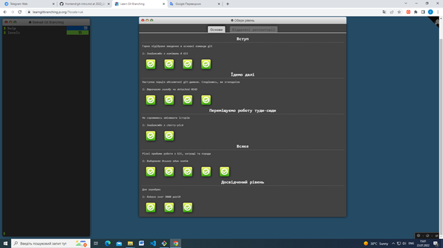
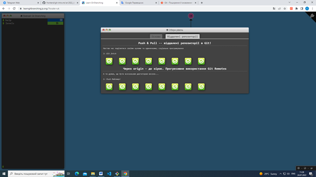

# kottans-frontend

## Git та GitHub

### Version Control with Git (Udacity)
 

  ##### назвіть (хоча б одну) річ яка була для вас новою
  З Git не працювала раніше.

- ##### назвіть (хоча б одну) річ яка вас здивувала
Кожен крок документується! 

- ##### назвіть (хоча б одну) річ яку ви збираєтесь використовувати у майбутньому
Some Git commands are:
 * git init * *створити новий репозиторій* *
 * git clone <path-to-repository-to-clone> * *клонувати репозиторій* *
 * git status * *визначити статус репозиторію* *
 * git log * *відобразити коміти сховища* *
 * git log --one line * *однією лінією* *
 * git log --stat * *перегляд змінених файлів* *
 * git log -p * *перегляд змін у файлі* *
 * git log -p --stat * *скільки файлів було змінено і кількість змінених рядків* *
 * git log -p -w * *ігнорувати пробіли* * 
 * git add <file1> <file2> ... <fileN> * *переміщення файлів із робочого каталогу до проміжного індексу* *
 * gid add . * *додати все* *
 * git show  * *показати комміт* *
 * git commit -m "My commit" * *додати комміт до репо* *
 * git diff * *перегляд внесених але ще не зафіксованих змін* *
 * git tag -a <tagName> -m "my version 1.4" * *додати таг до комміту* *
 * git tag -d <tagName> * *видалити таг* *
 * git branch * *список гілок у сховищі* *
 * git branch <branchName> <SHA> * *створити гілку* *
 * git branch -d <branchName> * *видалити гілку* *
 * git checkout <branchName> * *перейти на гілку* *
 * git log --oneline --decorate * *відображення гілок* *
 * git checkout -b footer master * *створити нову гілку та переключитися на неї* *
 * git log --oneline --decorate --graph --all * *переглянути всі гілки одразу* *
 * git reset --hard HEAD^ * *скасувати злиття* *
 * git merge <name-of-branch-to-merge-in> * *злиття гілок* *
 * git commit --amend * *зміна останнього комітту* *
 * git revert <SHA-of-commit-to-revert> * *повернення комміту* *
 * git reflog * *отримати доступ до стертого вмісту* *
 * git reset <reference-to-commit> * *скидання (стертя) комміту* *
 * git reset --mixed * *візьме зміни, внесені в комміт і перемістить їх до робочого каталогу* *
 * git reset --soft * *візьме зміни, внесені в комміт і перемістить їх до індекcу проміжку* *
 * git reset --hard * *візьме зміни, внесені в комміт і зітре їх* *
  .gitignore
  fileName

### learngitbranching

- ##### назвіть (хоча б одну) річ яка була для вас новою
git fetch, git cherry-pick, git pull ...
- ##### назвіть (хоча б одну) річ яка вас здивувала
Сленг в IT - суміш англійської та української.
- ##### назвіть (хоча б одну) річ яку ви збираєтесь використовувати у майбутньому
Some basic Git commands are:
* git rebase * *в основному автоматизована cherry-pick. Він визначає серію комітів, а потім вибирає їх один за одним у тому самому порядку в іншому місці.* *
* git rebase -i * *змінити порядок комітів, пропустити якісь коміти, об'єднати коміти в один.* *
* git cherry-pick <Commit1> <Commit2> <...> * *команда використовується для того, щоб прийняти зміни, внесені в один комміт Git, і спробувати повторно ввести їх як новий коміт у гілці, на якій ви зараз перебуваєте.* *
* git describe <посилання> * *описати, де ти є відносно найближчого орієнтира.* * 
* git fetch * *зв’язується з віддаленим репозиторієм і отримує всю інформацію, яка знаходиться в цьому сховищі, якої немає у вашому поточному, і зберігає її у вашій локальній базі даних.* *
* git pull * *по суті, є комбінацією команд git fetch і git merge, де Git отримуватиме дані з віддаленого пристрою, який ви вкажете, а потім негайно намагатиметься об’єднати його з гілкою, на якій ви перебуваєте.* *
* git pull --rebase * *Якщо поточна гілка та віддалена розійшлися, користувачеві потрібно вказати, як узгодити розбіжні гілки за допомогою --rebase або --no-rebase* *
* git push * *використовується для зв’язку з іншим репозиторієм, обчислення того, що ваша локальна база даних має, а віддалена — ні, а потім передає різницю в інше сховище. Для цього потрібен доступ для запису до іншого репозиторію, тому він зазвичай якимось чином автентифікується.* *
* git put * *Git отримає зміни із заданого віддаленого сховища. а потім відразу спробує злити їх до поточної гілки* *
* git remote add <name> <url> * *є інструментом керування вашим записом віддалених сховищ. Це дозволяє зберігати довгі URL-адреси як короткі дескриптори, наприклад «походження», щоб вам не потрібно було їх постійно вводити. Ви можете мати кілька таких, і git remoteкоманда використовується для їх додавання, зміни та видалення.* *
