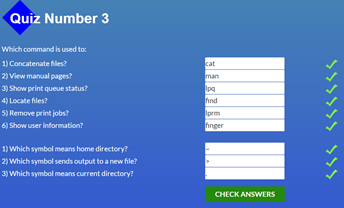

# kottans-frontend

## Git та GitHub

### Version Control with Git (Udacity)


##### назвіть (хоча б одну) річ яка була для вас новою

З Git не працювала раніше.

- ##### назвіть (хоча б одну) річ яка вас здивувала

  Кожен крок документується!

- ##### назвіть (хоча б одну) річ яку ви збираєтесь використовувати у майбутньому
  Some Git commands are:

* git init \* _створити новий репозиторій_ \*
* git clone <path-to-repository-to-clone> \* _клонувати репозиторій_ \*
* git status \* _визначити статус репозиторію_ \*
* git log \* _відобразити коміти сховища_ \*
* git log --one line \* _однією лінією_ \*
* git log --stat \* _перегляд змінених файлів_ \*
* git log -p \* _перегляд змін у файлі_ \*
* git log -p --stat \* _скільки файлів було змінено і кількість змінених рядків_ \*
* git log -p -w \* _ігнорувати пробіли_ \*
* git add <file1> <file2> ... <fileN> \* _переміщення файлів із робочого каталогу до проміжного індексу_ \*
* gid add . \* _додати все_ \*
* git show \* _показати комміт_ \*
* git commit -m "My commit" \* _додати комміт до репо_ \*
* git diff \* _перегляд внесених але ще не зафіксованих змін_ \*
* git tag -a <tagName> -m "my version 1.4" \* _додати таг до комміту_ \*
* git tag -d <tagName> \* _видалити таг_ \*
* git branch \* _список гілок у сховищі_ \*
* git branch <branchName> <SHA> \* _створити гілку_ \*
* git branch -d <branchName> \* _видалити гілку_ \*
* git checkout <branchName> \* _перейти на гілку_ \*
* git log --oneline --decorate \* _відображення гілок_ \*
* git checkout -b footer master \* _створити нову гілку та переключитися на неї_ \*
* git log --oneline --decorate --graph --all \* _переглянути всі гілки одразу_ \*
* git reset --hard HEAD^ \* _скасувати злиття_ \*
* git merge <name-of-branch-to-merge-in> \* _злиття гілок_ \*
* git commit --amend \* _зміна останнього комітту_ \*
* git revert <SHA-of-commit-to-revert> \* _повернення комміту_ \*
* git reflog \* _отримати доступ до стертого вмісту_ \*
* git reset <reference-to-commit> \* _скидання (стертя) комміту_ \*
* git reset --mixed \* _візьме зміни, внесені в комміт і перемістить їх до робочого каталогу_ \*
* git reset --soft \* _візьме зміни, внесені в комміт і перемістить їх до індекcу проміжку_ \*
* git reset --hard \* _візьме зміни, внесені в комміт і зітре їх_ \*
  .gitignore
  fileName

## Linux CLI, and HTTP

### Linux Survival





##### назвіть (хоча б одну) річ яка була для вас новою

Linux

- ##### назвіть (хоча б одну) річ яка вас здивувала

  Команди Linux і Windows схожі

- ##### назвіть (хоча б одну) річ яку ви збираєтесь використовувати у майбутньому

cd, pwd, rm, rmdir, find, finger ...

### HTTP: Протокол, який повинен розуміти кожний веб-розробник

##### назвіть (хоча б одну) річ яка була для вас новою

Порт за налаштуванням для HTTP – 80.
Методи:

- GET: для запиту ресурсу.
- POST: для створення нового ресурсу.
- PUT: для оновлення існуючого ресурсу.
- DELETE: для видалення існуючого ресурсу.
- HEAD: подібний до GET, проте не передається тіло повідомлення.
- TRACE: використовується для отримання від сервера інформації про "стрибки", через які пройшов запит. Його можна використовувати для діагностики.
- OPTIONS: для отримання підтримуваних сервером можливостей. На стороні клієнта його можна використовувати для зміни запиту в залежності від можливостей, підтримуваних сервером.

Інструменти для перегляду мережного трафіку за HTTP:

- інспектор Chrome/Webkit
- проксі для налагодження веб-застосунків, наприклад, Fiddler
- Charles Proxy (для OSX)
- програми з інтерфейсом командного рядка curl, tcpdump та tshark.
  На стороні клієнта застосування, що використовує HTTP, розпізнається за допомогою набору <IP, port>.
  Встановлення з'єднання між двома кінцевими вузлами локальної мережі (ЛМ) – процес, що складається з декількох етапів:
- встановлення відповідності імені хоста IP-адресі за допомогою DNS
- встановлення з’єднання з сервером
- відправлення запиту
- очікування відповіді
- закриття з'єднання
  Постійні з'єднання – довготривалі з'єднання, що залишаються відкритими, доки клієнт їх не закриє. Паралельні з'єднання – створюється набір із декількох з'єднань (звичайно максимум – шість з'єднань).

##### назвіть (хоча б одну) річ яка вас здивувала

Дуже багато теоретичної інформації, яку складно зрозуміти без практики.

- ##### назвіть (хоча б одну) річ яку ви збираєтесь використовувати у майбутньому
  Методи: GET, POST, PUT, DELETE, HEAD ...

## Git Collaboration

### Introduction to Git and GitHub


##### назвіть (хоча б одну) річ яка була для вас новою

git-remote - \* _керування набором відстежуваних репозиторіїв_ _
[Lists remote repos](https://git-scm.com/docs/git-remote)
git-fetch — _ _завантажує об’єкти та посилання з іншого репозиторію_ _
[git fetch](https://git-scm.com/docs/git-fetch)
git-branch - _ _список, створення або видалення гілок_ \*
[git branch](https://git-scm.com/docs/git-branch#Documentation/git-branch.txt--r)
[merge conflicts](https://help.github.com/en/github/collaborating-with-issues-and-pull-requests/about-merge-conflicts)
[Resolving a merge conflict using the command line](https://docs.github.com/en/pull-requests/collaborating-with-pull-requests/addressing-merge-conflicts/resolving-a-merge-conflict-using-the-command-line)
[git rebase branchname](https://git-scm.com/book/en/v2/Git-Branching-Rebasing)

Форкінг - це спосіб створення копії даного репозиторію. При спільній роботі над проектами, розміщеними на GitHub, типові робочі процеси спочатку створюють вилку репо, а потім працюють над цією локальною вилкою. Таким чином, ми можемо зрештою об'єднати наші зміни назад в основне репо, створивши запит на витягування. Pull Request - це комміт чи серія коммітів, які ви надсилаєте власнику репозиторію, щоб він включив його у своє дерево.
[pull request](https://docs.github.com/en/pull-requests)
[About pull request merges](https://docs.github.com/en/pull-requests/collaborating-with-pull-requests/incorporating-changes-from-a-pull-request/about-pull-request-merges)
[Style Guides](https://google.github.io/styleguide/)
[About pull request reviews](https://docs.github.com/en/pull-requests/collaborating-with-pull-requests/reviewing-changes-in-pull-requests/about-pull-request-reviews)
[The Perfect Code Review Process](https://medium.com/osedea/the-perfect-code-review-process-845e6ba5c31)
[What is Code Review?](https://smartbear.com/learn/code-review/what-is-code-review/)
[Linking a pull request to an issue](https://docs.github.com/en/issues/tracking-your-work-with-issues/linking-a-pull-request-to-an-issue)
[Setting guidelines for repository contributors](https://docs.github.com/en/communities/setting-up-your-project-for-healthy-contributions/setting-guidelines-for-repository-contributors)
[What is CI/CD?](https://stackify.com/what-is-cicd-whats-important-and-how-to-get-it-right/)
[Travis CI Tutorial](https://docs.travis-ci.com/user/tutorial/)

##### назвіть (хоча б одну) річ яка вас здивувала

Ця інформація потрібна була на початковому етапі при створенні репозиторію в Github. Це б зекономило купу часу.

##### назвіть (хоча б одну) річ яку ви збираєтесь використовувати у майбутньому

pull request, Code Review

### learngitbranching


- ##### назвіть (хоча б одну) річ яка була для вас новою
  git fetch, git cherry-pick, git pull ...
- ##### назвіть (хоча б одну) річ яка вас здивувала
  Сленг в IT - суміш англійської та української.
- ##### назвіть (хоча б одну) річ яку ви збираєтесь використовувати у майбутньому
  Some basic Git commands are:

* git rebase \* _в основному автоматизована cherry-pick. Він визначає серію комітів, а потім вибирає їх один за одним у тому самому порядку в іншому місці._ \*
* git rebase -i \* _змінити порядок комітів, пропустити якісь коміти, об'єднати коміти в один._ \*
* git cherry-pick <Commit1> <Commit2> <...> \* _команда використовується для того, щоб прийняти зміни, внесені в один комміт Git, і спробувати повторно ввести їх як новий коміт у гілці, на якій ви зараз перебуваєте._ \*
* git describe <посилання> \* _описати, де ти є відносно найближчого орієнтира._ \*
* git fetch \* _зв’язується з віддаленим репозиторієм і отримує всю інформацію, яка знаходиться в цьому сховищі, якої немає у вашому поточному, і зберігає її у вашій локальній базі даних._ \*
* git pull \* _по суті, є комбінацією команд git fetch і git merge, де Git отримуватиме дані з віддаленого пристрою, який ви вкажете, а потім негайно намагатиметься об’єднати його з гілкою, на якій ви перебуваєте._ \*
* git pull --rebase \* _Якщо поточна гілка та віддалена розійшлися, користувачеві потрібно вказати, як узгодити розбіжні гілки за допомогою --rebase або --no-rebase_ \*
* git push \* _використовується для зв’язку з іншим репозиторієм, обчислення того, що ваша локальна база даних має, а віддалена — ні, а потім передає різницю в інше сховище. Для цього потрібен доступ для запису до іншого репозиторію, тому він зазвичай якимось чином автентифікується._ \*
* git put \* _Git отримає зміни із заданого віддаленого сховища. а потім відразу спробує злити їх до поточної гілки_ \*
* git remote add <name> <url> \* _є інструментом керування вашим записом віддалених сховищ. Це дозволяє зберігати довгі URL-адреси як короткі дескриптори, наприклад «походження», щоб вам не потрібно було їх постійно вводити. Ви можете мати кілька таких, і git remoteкоманда використовується для їх додавання, зміни та видалення._ \*

## Intro to HTML and CSS

### [ Intro to HTML & CSS](https://www.coursera.org/learn/html-css-javascript-for-web-developers/lecture)


### [Learn HTML](https://www.codecademy.com/learn/learn-html)


### [Learn CSS](https://www.codecademy.com/learn/learn-css)


- ##### назвіть (хоча б одну) річ яка була для вас новою
  У відео: SublimeText 3, Browser sync. Я використовую Visual Studio Code, Live Server.
  Resources:
- W3C
- caniuse.com
- validator.w3.org
- csszengarden.com

Вивчала HTML, CSS в Codecademy раніше, Bootstrap на інших ресурсах.

- ##### назвіть (хоча б одну) річ яка вас здивувала
  Вчитися по відео мені складно, краще сприймаю інформацію, коли я її практикую. Майже все було знайомим.
- ##### назвіть (хоча б одну) річ яку ви збираєтесь використовувати у майбутньому

<!--
<!DOCTYPE html>
<html lang="en-US">
<head>
    <meta charset="utf-8">
    <meta name="author" content="Larysa Trostinetska">
    <meta name="description" content="">
    <meta name="viewport" content="width=device-width, initial-scale=1"/>
    <title>My title</title>
    -->
  <!--Fonts-->
<!--
    <link rel="preconnect" href="https://fonts.googleapis.com">
    <link rel="preconnect" href="https://fonts.gstatic.com" crossorigin>
    <link href="https://fonts.googleapis.com/css2?family=Fanwood+Text&family=Shrikhand&display=swap" rel="stylesheet">
-->
   <!-- displays site properly based on user's device -->
  <!--add Bootstrap 4 befor my css-->
  <!--<link rel="stylesheet" href="https://cdn.jsdelivr.net/npm/bootstrap@4.6.1/dist/css/bootstrap.min.css" integrity="sha384-zCbKRCUGaJDkqS1kPbPd7TveP5iyJE0EjAuZQTgFLD2ylzuqKfdKlfG/eSrtxUkn" crossorigin="anonymous">
  -->
<!--CSS-->
  <!--<link rel="stylesheet" href="normalise.css" type="text/css">
    <link rel="stylesheet" href="styles.css" type="text/css">
</head>
<body>
    <header>
        <nav>
            <a href="#home">Home</a>
        </nav>
    </header>
    <main>
    -->
  <!--images -->
  <!--
                <figure>
                    
                </figure>
                <figcaption>You don't need to be the athlete</figcaption>
                -->
<!--Для того щоб додати кілька малюнків srcset-->
  <!--<picture>
                <source media="(max-width: 375px)" srcset="./images/image-product-mobile.jpg">
                <source media="(min-width: 600px)" srcset="./images/image-product-desktop.jpg">
                
            </picture>
        <section class="">    
        </section>
        <article>
        </article>
        <aside>
        </aside>
  -->
<!--audio, video, gif-->
<!--<audio controls>
        <source src="" type="audio/mp3">
      </audio>
      <video src="" controls>
      </video>
      <embed src=""/>
    </main>
    <footer>
    </footer>
    <script src="https://cdn.jsdelivr.net/npm/jquery@3.5.1/dist/jquery.slim.min.js" integrity="sha384-DfXdz2htPH0lsSSs5nCTpuj/zy4C+OGpamoFVy38MVBnE+IbbVYUew+OrCXaRkfj" crossorigin="anonymous"></script>
    <script src="https://cdn.jsdelivr.net/npm/bootstrap@4.6.1/dist/js/bootstrap.bundle.min.js" integrity="sha384-fQybjgWLrvvRgtW6bFlB7jaZrFsaBXjsOMm/tB9LTS58ONXgqbR9W8oWht/amnpF" crossorigin="anonymous"></script>
</body>
</html>
-->

[HTML Codecademy](https://www.codecademy.com/learn/learn-html/modules/learn-html-elements/cheatsheet)

<!--
###### table
 <table>
      <coption>
      <thead>
        <tr>
          <th scope="col"></th>
          <th scope="col"></th>
        </tr>
      </thead>
      <tbody>
        <tr>
          <td></td>
          <td></td>
        </tr>
        <tr>
          <td></td>
          <td></td>
        </tr>
        </tbody>
        <tfoot>
          <tr>
            <td></td>
            <td colspan="2"></td>
          </tr>
        </tfoot>
        </coption>
    </table>
-->
<!--###### form
<form action="submission.html" method="GET">
        <label for="username">Username:</label>
        <br>
				<input id="username" name="username" type="text" required minlength="3" maxlength="15">
        <br>
        <label for="pw">Password:</label>
        <br>
				<input id="pw" name="pw" type="password" required minlength="8" maxlength="15">
        <br>
        <input type="submit" value="Submit">
      </form>
      -->

<!--The purpose of a <form> is to allow users to input information and send it.
The <form>‘s action attribute determines where the form’s information goes.
The <form>‘s method attribute determines how the information is sent and processed.
To add fields for users to input information we use the <input> element and set the type attribute to a field of our choosing:
Setting type to "text" creates a single row field for text input.
Setting type to "password" creates a single row field that censors text input.
Setting type to "number" creates a single row field for number input.
Setting type to "range" creates a slider to select from a range of numbers.
Setting type to "checkbox" creates a single checkbox which can be paired with other checkboxes.
Setting type to "radio" creates a radio button that can be paired with other radio buttons.
Setting type to "list" will pair the <input> with a <datalist> element if the id of both are the same.
Setting type to "submit" creates a submit button.
A <select> element is populated with <option> elements and renders a dropdown list selection.
A <datalist> element is populated with <option> elements and works with an <input> to search through choices.
A <textarea> element is a text input field that has a customizable area.
When a <form> is submitted, the name of the fields that accept input and the value of those fields are sent as name=value pairs.
Using the <form> element in conjunction with the other elements listed above allows us to create sites that take into consideration the wants and needs of our users. Take the opportunity to take what you’ve learned, and apply it!-->
<!--
/*Global styles*/
html {
}

*,
*::before,
*::after {
    box-sizing: inherit;
}

main {
}

/*typography*/

h1 {
}

/* header*/

header {
}

a {
}

/*main */

img {
    max-width: 100%;
    height: auto;
}

figure {
}

figcaption {
    text-align: center;
}

.contact {
    display: flex;
    flex-direction: row;
    justify-content: space-around;
    align-items: flex-start;
    flex-wrap: wrap;
}

/*footer*/

footer {
    text-align: center;
}

/*buttons*/

button {
}

/*media*/

@media only screen and (max-width: 650px) {
    html {
        font-size: 16px;
    }
}


/*body in center центрування елементу на сторінці*/
    body {
    position: absolute;
    top: 50%;
    left: 50%;
    margin-right: -50%;
    transform: translate(-50%, -50%);
    }
-->

[css codecademy](https://www.codecademy.com/learn/learn-css/modules/syntax-and-selectors/cheatsheet)

[MDN Web Docs](https://developer.mozilla.org/en-US/)

[Learn web development - mdn](https://developer.mozilla.org/en-US/docs/Learn)

## Responsive Web Design

### [Основи адаптивного веб-дизайну](https://web.dev/i18n/en/responsive-web-design-basics/)

- ##### назвіть (хоча б одну) річ яка була для вас новою

1. Встановити вікно перегляду
<meta name="viewport" content="width=device-width, initial-scale=1">
2. Розмір вмісту відповідно до області перегляду

- зображення

```
img {
 max-width: 100%;
 display: block;
}
```

- Flexbox
- CSS Grid Layout
- Макет із кількома стовпцями Multicol

3. Використовуйте медіа-запити CSS для швидкої реакції

- width (min-width, max-width)
- height (min-height, max-height)
- orientation
- aspect-ratio
- hover
- pointer
- any-hover
- any-pointer

4. Виберіть основні точки зупину, починаючи з малого, а потім продовжуючи
5. Перегляд точок зупинки медіа-запитів у Chrome DevTools

```
@media (max-width: 600px) {
}
@media (min-width: 601px) {
}
```

- ##### назвіть (хоча б одну) річ яка вас здивувала
  В медіа-запитах використовується не лише ширина чи довжина екрану.
- ##### назвіть (хоча б одну) річ яку ви збираєтесь використовувати у майбутньому
  Медіа-запити, Flexbox, Grid ...

### [FLEXBOX. Вчимося верстати на флексах](https://www.youtube.com/playlist?list=PLM6XATa8CAG5mPV60dMmjMRrHVW4LmV2x)

### [Flexbox Froggy](http://flexboxfroggy.com/#uk) - гра для закріплення


- ##### назвіть (хоча б одну) річ яка була для вас новою
  _order_
  .yellow {
  order: 3;
  }
- ##### назвіть (хоча б одну) річ яка вас здивувала
  Переміщення елементів в іншому порядку.
- ##### назвіть (хоча б одну) річ яку ви збираєтесь використовувати у майбутньому

```
section {
  display: flex;
}
 display: inline-flex;
```


_flex-direction_ визначає напрямок елементів в контейнері та може набувати наступних значень:

- row: елементи розташовані так само, як напрямок тексту.
- row-reverse: елементи розташовані протилежно напрямку тексту.
- column: елементи розташовані з гори до низу.
- column-reverse: елементи розташовані з низу до гори.

_justify-content_ вирівнює елементи по горизонталі й набуває таких значень:

- flex-start: Елементи вирівнюються по лівій стороні контейнера.
- flex-end: Елементи вирівнюються по правій стороні контейнера.
- center: Елементи вирівнюються по центру контейнера.
- space-between: Елементи буде зображено з рівними відступами поміж них.
- space-around: Елементи буде зображено з рівними відступами навколо них.

_align-items_ вирівнює елементи вертикально і може набувати таких значень:

- flex-start: елементи вирівнюються за верхнім краєм контейнеру.
- flex-end: елементи вирівнюються за нижнім краєм контейнеру.
- center: елементи вирівнюються вертикально по середині контейнера.
- baseline: елементи буде розміщено на базовій лінії контейнера.
- stretch: елементи розтягуються заповнюючи контейнер.

_align-self_ (застосувується до окремого елементу) вирівнює flex-елемент вздовж перетинної осі, перекриваючи значення властивості align-items. Ця властивість набуває тих самих значень, що й align-items:
flex-start, flex-end, center, baseline, stretch

_flex-wrap_ :
nowrap: Кожен елемент буде розташований один за одним в одному рядку. Ширина елементів встановлюється автоматично, щоб вміститись в рядок.
wrap: Елементи переносятся до наступного рядка.
wrap-reverse: Елементи переносятся до наступного рядка у зворотньому порядку.

Дві властивості flex-direction та flex-wrap найчастіше використовуються разом, тому існує скорочена властивість _flex-flow_, що обʼєднує їх. Ця властивість приймає одне значення кожної з властивостей, які відокремлені пробілом.
flex-flow: row wrap;

_align-content_, щоб вказати як декілька рядків мають бути розташовані один до одного. Властивість набуває таких значень:

- flex-start: Рядки буде розташовано вгорі контейнеру.
- flex-end: Рядки буде розташовано внизу контейнеру.
- center: Рядки групуються вертикально по центру контейнеру.
- space-between: Рядки розташовуються з однаковими проміжками навколо них.
- space-around: Рядки розташовуються з однаковими проміжками між ними.
- stretch: Рядки розтягуються заповнюючи контейнер рівномірно.
  align-content визначає інтервал поміж рядками, в той час як _align-items_ визначає, як елементи буде вирівняно в контейнері в цілому. Коли у вас лише один рядок, align-content не має ніякого ефекту.

```
*flex-basis*: auto; 500px; 30%;

*flex-grow*: 0; 1 ...

*flex-shrink*: 1; 0 ...

flex-grow, flex-shrink, flex-basis together:
*flex*: 0 1 auto;
```

[Шпаргалка по Flexbox](https://fls.guru/flexbox.html)

### [CSS Grid Layout](https://www.youtube.com/watch?v=GV92IdMGFfA&list=PLM6XATa8CAG5pXQrW_kDaeZb_uIAMNZIm)

### [Grid Garden](http://cssgridgarden.com/) - гра для закріплення.

- ##### назвіть (хоча б одну) річ яка була для вас новою

```
order: 1;
grid-temlate:
[start] "header header" 100px [row2]
[row2] "side content" 1fr [row-end] / 150px 1fr;
```

- ##### назвіть (хоча б одну) річ яка вас здивувала
  Спосіб запису:

```
grid-temlate:
[start] "header header" 100px [row2]
[row2] "side content" 1fr [row-end] / 150px 1fr;
```

- ##### назвіть (хоча б одну) річ яку ви збираєтесь використовувати у майбутньому

```
display:grid;
display: inline-grid;
grid-template-columns: auto 200px 1fr 30%; repeat(3, 1fr)
grid-template-rows: 200px minmax(150px, 1fr) fit-content(100px)
repeat(auto-fit, minmax(60px, 1fr));
grid-template: rows / columns;

grid-column-gap: 10px;
grid-rows-gap: 5px;
grid-gap: 5px 10px; (rows) (columns)
gap: 20px;

grid-template-areas:
"header header header"
"advert content content"
"advert footer footer"

grid-area: header; footer; content ...
Для неявної сітки:
grid-auto-rows: 200px;
grid-auto columns: 100px;
grid-auto-flow: row or column or dense;

grid-row-start: auto or span 2
grid-row-end: 3
grid-column-start: 1
grid-column-end: 3

grid-template-rows: [start] 1fr [row2] 1fr [row-end];
grid-template-columns: [start] 1fr [col2] 1fr [col3] 1fr [col-end];
grid-row-start: start;
grid-column-start: col3;

grid-row: 1 / 4;
grid-column: 1 / 3;
grid-area: horisontal line to start at/ vertical line to start at/ horisontal line to end at / vertical line to end at;

order: 1;

Вирівнювання елементів сітки:
justify-self(по горизонталі): stretch(default), start, end, center;
align-self(по вертикалі): stretch, start, end, center;
Вирівняти всі елементи в сітці:
justify-items: stretch(default), start, end, center;
align-items: stretch(default), start, end, center;
```

[CSS Grid Layout](https://fls.guru/grid.html)

## HTML & CSS Practice: Hooli-style Popup

### Links

- Solution URL: [hooli-style-popup](https://github.com/Lara-trost/hooli-style-popup)
- Live Site URL: [hooli-style-popup](https://lara-trost.github.io/hooli-style-popup/)

##### назвіть (хоча б одну) річ яка була для вас новою

Popup, checkbox

- ##### назвіть (хоча б одну) річ яка вас здивувала

Невидимим елементам теж потрібен focus.

- ##### назвіть (хоча б одну) річ яку ви збираєтесь використовувати у майбутньому

Приховування елементів, створення чекбоксу, focus, within-focus.
